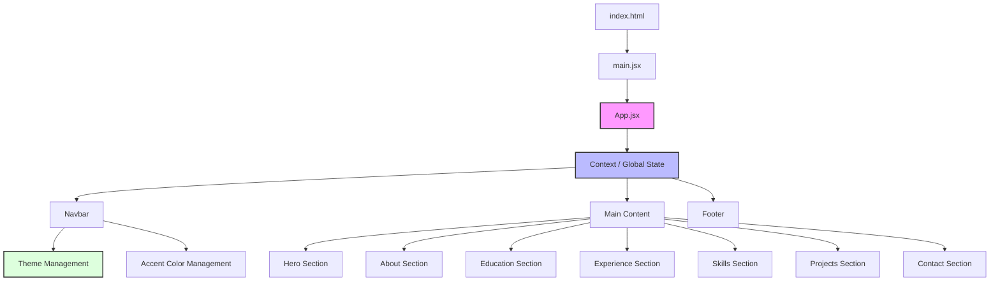

# ⚡ Purva Lad | Professional Portfolio

A high-fidelity, performant digital ecosystem engineered for modern web standards and exceptional user experience.

---

## 📝 Overview

**Purva Portfolio** is a sophisticated architectural implementation of a modern digital identity. Built with a focus on modularity and performance, it showcases a seamless integration of contemporary design principles and efficient software engineering. The platform is designed to provide an immersive experience while maintaining a lightweight footprint.

## 🏗️ System Architecture

The following diagram illustrates the high-level architecture of the application, highlighting the unidirectional data flow and component-based structure.



## ✨ Key Features

- 🎨 **Dynamic Personalization**: Real-time theme switching (Light/Dark) and accent color customization.
- 🚀 **Performance Optimized**: Built with Vite for near-instant hot module replacement (HMR) and optimized build assets.
- 📱 **Fluid Responsiveness**: Engineered with CSS Flexbox and Grid for a flawless experience across all screen dimensions.
- 🎭 **Interactive Micro-animations**: Subtle scroll reveal effects and hover states to enhance user engagement.
- 🛠️ **Modular Components**: Highly reusable React component architecture for scalability and maintainability.

## 🛠️ Tech Stack

### Core Technologies
- **Frontend**: `React 18`
- **Build Tool**: `Vite`
- **Styling**: `Vanilla CSS` (Custom Design System)
- **Deployment**: `GitHub Pages / Vercel`

### Development Environment
- `ESLint` for code quality
- `NPM` for package management

## 🚀 Getting Started

### Prerequisites
- Node.js (v16.x or higher)
- npm (v7.x or higher)

### Installation & Local Execution

```bash
# Clone the repository
git clone https://github.com/purvalad42-cloud/my-portfolio.git

# Navigate to project directory
cd my-portfolio

# Install dependencies
npm install

# Run the development server
npm run dev
```

## 🌐 Deployment Pipeline

The project is architected for seamless CI/CD integration.

- **Build Command**: `npm run build`
- **Output Directory**: `dist/`
- **Target Platform**: Optimized for Vercel, Netlify, and GitHub Pages.

---

## 👩‍💻 Developer

**Purva Lad**  
*Specializing in building premium, state-of-the-art digital experiences.*

---
© 2026 Purva Lad. All rights reserved.
